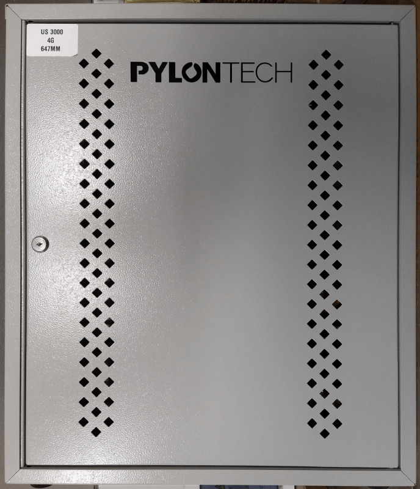
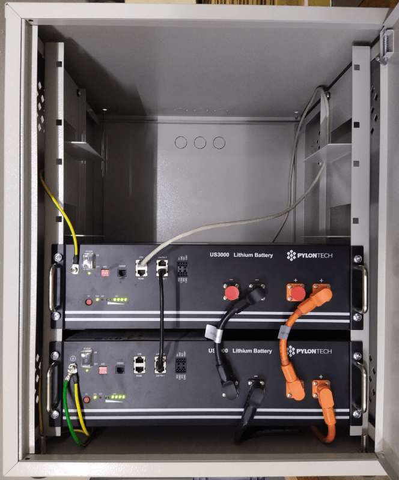
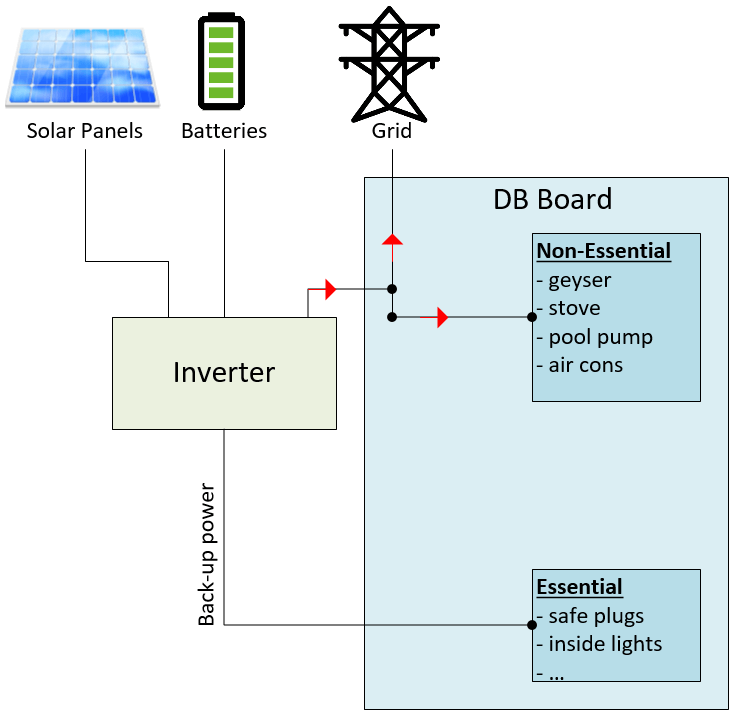
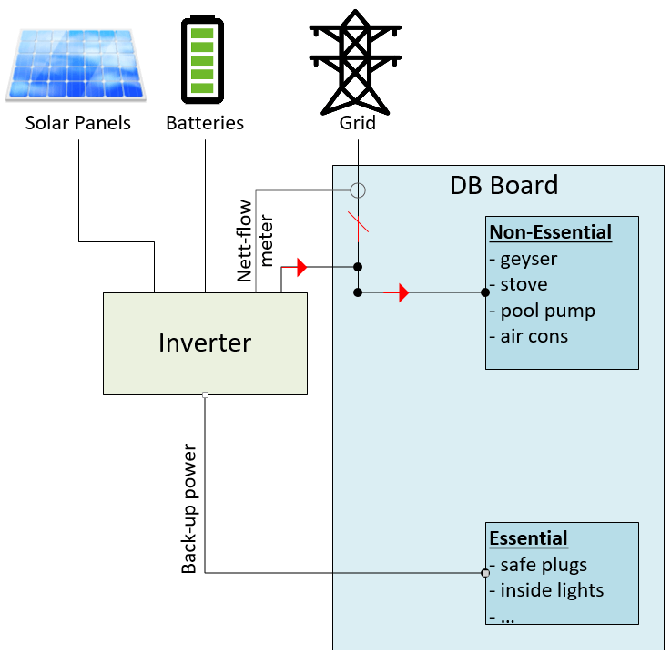
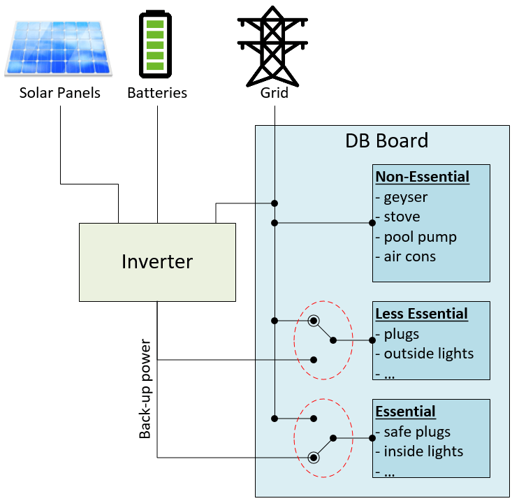
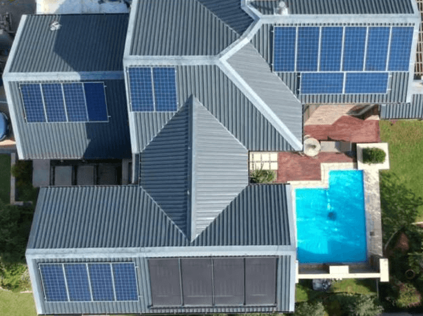
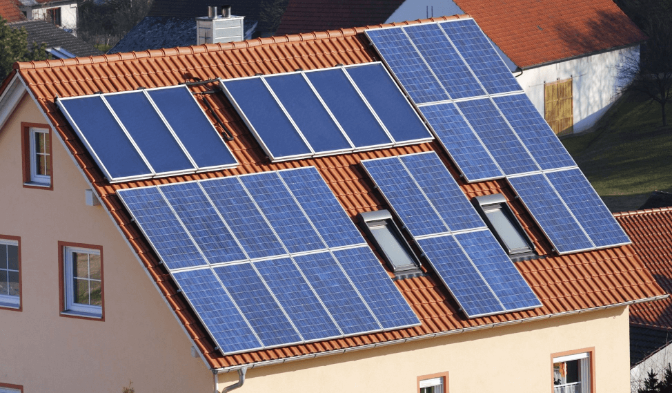
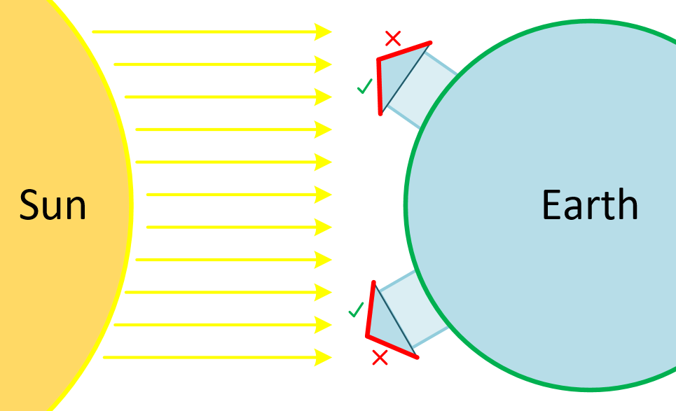

Due to an increase in power interruptions where I live, I decided to bite the bullet and get a solar based backup power solution with lithium batteries and a hybrid inverter.  In the process I realised that I had a couple of misconceptions of these systems.  I also realised that my misconceptions are quite common when I explained the system to friends.  With this article I hope that I can help others in clearing up some of these.

**Table of Contents**
* [Batteries](#batteries)
* [Cheap inverters are expensive](#cheap-inverters)
* [Non-inverter connected appliances can also get solar savings](#non-inverter_connected_appliances)
* [Rate inverter power capacity for backup, not saving](#rate-inverter-power-capacity-for-backup)
* [Grids that don't support net-metering](#grids-that-dont-support-net-metering)
* 
* 
* 
* 
* 

<a name="batteries"/>

## Batteries
### Lithium has replaced lead acid batteries
Before doing my installation I was under the impression that lead acid batteries are still the default battery choice and also the only affordable choice.  That is not the case anymore.  Lithium batteries have come down in price thanks to mass production scale (we can thank the rise of electric vehicles for that).  Also, given all its advantages (e.g. deep discharge, many charge cycles, low weight) one should not consider lead acid batteries anymore.

### Tesla PowerWall is not the only lithium option
I was also under the wrong impression that the Tesla PowerWall is the only viable lithium battery option on the market.  This has also changed.  There are by now many more choices available.  The lithium batteries in my installation are Pylontech US3000 with a capacity of 3.5kWh and a 10 year guarantee.  Other battery makes supported by my inverter are: BYD, GCL and LG.  Tesla has actually partnered with LG and Panasonic to produce its PowerWall and electric vehicle batteries.

A nice surprise was that the batteries can get installed neatly into a standard 19 inch rack typically used for network and computing equipment in server rooms.  However, not all battery types will follow this rack installation standard.

The interface with the batteries also include more than just a plus and minus power terminal.  There are also ports for multiple batteries to communicate with each other, a port for communication with the inverter, a debugging/servicing port, state-of-charge indicators etc.

<a name="cheap-inverters"/>

## Cheap inverters are expensive
The inverter that I got is a GoodWe GW5048D-ES hybrid inverter.  It was more expensive than I expected.  Especially since most common media advertisements I saw showed cheaper options.  However, from discussions with others who have done solar installations it was clear that buying cheap costs you more in the long run due to replacements.

<a name="non-inverter_connected_appliances"/>

## Non-inverter connected appliances can also get solar savings
An appliance does not have to be connected to the inverter output to get savings from solar.  If the inverter supports pushing surplus power back into the grid (net metering), it will also push this surplus power into other appliances in the home not connected to the interver’s output.  These appliances then effectively use the surplus solar power and only the balance from the grid.

<a name="rate-inverter-power-capacity-for-backup"/>

## Rate inverter power capacity for backup, not saving
An appliance therefore only needs to be connected to the inverter output if it requires backup power during a grid power interruption, not to benefit from solar savings.  The inverter power rating can therefore be much lower since it only needs to cater for backup load.

<!-- TODO: picture -->

<a name="grids-that-dont-support-net-metering"/>

## Grids that don't support net-metering
The above setup is only available if the inverter supports net metering.  However, our electricity company doesn’t allow net metering on the grid.  This turns out to also not be a problem.  The inverter is able to monitor the power coming into the home from the grid with a meter connected to the grid line coming into the DB board.  When the meter shows that power is being pushed back into the grid the inverter starts to limit the surplus power and only supplies the surplus to appliances in the home.

It is not possible for the inverter to always fully stop power flowing back into the grid and one can still see up to about 30W flowing back into the grid.  TODO: picture from portal showing 30W

In the event that there is a grid power interruption, the inverter will stop all surplus power flowing back into the home and grid and will only supply backup power to appliances connected to its output.  I assume this is due to safety and technical reasons.

## Circuits with mixed essential and non-essential loads
You don’t want the likes of a heater connected to your inverter output because it will drain the battery quickly due to its high power consumption (except if you’re willing to invest a lot of money for bigger batteries and inverter).

But what if you have a circuit that powers your TV (which you do want on back-up power) and has a plug to which a heater might be connected?  I thought it would be necessary to split those circuits into two and hope that family members remember to not plug heavy-load appliances into plug sockets of backup circuits.

Luckily the installer had a simpler solution by using a switch-over switch on the BD board for those mixed circuits.  By default the circuit is connected to grid power.  During a power interruption, you can make sure that no heavy load appliances are connected to the circuit and then switch the circuit over to backup power on the DB board.

The picture above shows these "less-essential" circuits fronted by a switch-over switch that is by default connected to the grid.  In the event of a power interruption, one can ensure that any heavy load appliances are switched off and then the switch-over switch can be switched to back-up power.
The picture also shows the essential circuits fronted by a switch-over switch.  This one is by default connected to back-up power since it should only have light loads connected. A power interruption will therefore not impact these connected loads.  The only reason to switch it to grid power is when the inverter needs to go down for maintenance.

## Switching on certain loads only when surplus power available

To maximize savings from solar power, a good strategy is to switch appliances on (where possible) only when there is surplus power from solar or batteries.

Good examples are the pool pump, geyser and charging the lithium batteries.

### Example - Pool pump
If the pool pump is running when no surplus solar power is available, then the lacking power will be provided by the grid.  Since it is fine for the pump to run at a later time, its operation can wait till surplus solar power is available thereby maximising savings from solar.

### Example - Batteries
A typical strategy for an inverter is to only charge the batteries when surplus power is available.  This works well on a sunny day.  However, on a rainy day there is a risk that the batteries might not get fully charged by solar to have sufficient charge for backup power in case of a power interruption.  In this case the inverter’s charging strategy can be changed to charge the batteries from grid power as soon as possible if no surplus solar power is available.

### Example - Electric geyser as solar energy store
Since we have a gas geyser, a future optimisation strategy is to install an electric geyser before the gas geyser.  When surplus solar power is available, it can be used to heat the water in the electric geyser.  Later when hot water is needed, the gas heater needs to do less heating to get the water to the required temperature.  The electric geyser therefore becomes an energy store of solar power, similar to the batteries.

## Roof design that maximises solor power potential
If you are designing a new house then your architect must factor in a roof design that optimizes solar panel placement.

### Simple roof design
You want to be able to fit as many solar panels as possible on the roof.  Maybe not initially, but you want to option to expand in future.
The following picture shows my complicated roof design and how difficult it was to fit all the solar panels on.  Some panels also get shade in the afternoon.

Now compare that with the following simpler roof design.

### Roof angle
Solar panels are usually mounted flat against the roof surface, but not every roof is angled to best capture the sun’s energy.
A roof design should aim to maximise the angles facing the sun. In the Northern hemisphere this should be South facing and in the Southern hemisphere North facing.

