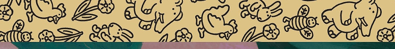

As a father with a kid that still believes in the tooth fairy,
there is an unrealistic expectation on me to make story time unforgettable.
On a good day this includes acting, character specific voices and sound effects.
Delivering on this expectation is not easy, but it got a lot easier with the Google speaker’s read-along feature.
Here is how it works:

## Scenario
My kid chooses, lets say, Peter Pan for the evening’s story (like the countless evenings before).
I get into a comfortable reading position and say to the Google speaker next
to bed: *“Hey Google, read along with Peter Pan”*.  
The speaker starts to play background music from Disney’s Peter Pan movie.
As I then read the story, the speaker listens and changes the background
music to be relevant to the paragraph I’m reading.  
It also adds sound effects at the right moments.
For example, when I read the part where Peter teaches the Darling children to fly,
the change in background music is upbeat and you feel anything is possible.
There is even a barking sound effect when I read about Nana the dog.  
When it is a fighting scene between Peter and Captain Hook, the music is tense and includes clashing sword sounds.  
Another feature is that you can stop reading and talk about other things or
skip to a specific part in the book and read-along will just pick up from that point.

So, with read-along as wingman, story time now lives up to my kid’s expectations.

## Setup
To get this setup going you’ll need a Google speaker and a supported book.
You can find the list of supported books <a href="https://support.google.com/googlenest/answer/9164015" target="_blank">here</a>.
Note that it must be from the Little Golden Books series to be compatible (except for the free Ara the Star Engineer ebook).
These books have this distinctive border:

Below I’ve listed shopping links to the speaker and books:
* <a href="https://store.google.com/us/product/google_nest_mini" target="_blank">Google Speaker</a>
* Books
  * <a href="https://www.amazon.com/Aladdin-Disney-Little-Golden-Book/dp/0736422595" target="_blank">Aladdin</a>
  * <a href="https://www.amazon.com/Disneys-Alice-Wonderland-Little-Golden/dp/0736426701" target="_blank">Alice in Wonderland</a>
  * <a href="https://www.amazon.com/Ara-Star-Engineer-Komal-Singh/dp/1989025056" target="_blank">Ara the Star Engineer</a> *(free on Kindle)*
  * <a href="https://www.amazon.com/Walt-Disneys-Cinderella-Little-Golden/dp/0736423621" target="_blank">Cinderella</a>
  * <a href="https://www.amazon.com/Coco-Little-Golden-Disney-Pixar/dp/0736438009" target="_blank">Coco</a>
  * <a href="https://www.amazon.com/Frozen-Little-Golden-Book-Disney/dp/0736430512" target="_blank">Frozen</a>
  * <a href="https://www.amazon.com/Frozen-Little-Golden-Book-Disney/dp/0736440208" target="_blank">Frozen 2
  * <a href="https://www.amazon.com/Incredibles-Jack-Jack-Attack-Little-Golden/dp/073642377X" target="_blank">Jack Jack Attack</a>
  * <a href="https://www.amazon.com/Lion-King-Little-Golden-Book/dp/0736420959" target="_blank">Lion King</a>
  * <a href="https://www.amazon.com/Mickey-Mouse-His-Spaceship-Disney/dp/0736436332" target="_blank">Mickey Mouse and his Spaceship</a>
  * <a href="https://www.amazon.com/Disneys-Mickey-Christmas-Shopping-Little/dp/0736440259" target="_blank">Mickey Mouse Goes Christmas Shopping</a>
  * <a href="https://www.amazon.com/Disneys-Mickeys-Christmas-Little-Golden/dp/0307987892" target="_blank">Mickey’s Christmas Carol</a>
  * <a href="https://www.amazon.com/Moana-Little-Golden-Book-Disney/dp/0736436030" target="_blank">Moana</a>
  * <a href="https://www.amazon.com/Mulan-Disney-Princess-Little-Golden/dp/0736430539" target="_blank">Mulan</a>
  * <a href="https://www.amazon.com/Disneys-Disney-Classic-Little-Golden/dp/0736402381" target="_blank">Peter Pan</a>
  * <a href="https://www.amazon.com/Story-Disney-Pixar-Little-Golden/dp/073642668X" target="_blank">Toy Story 3</a>
  * <a href="https://www.amazon.com/Three-Little-Disney-Classic-Golden/dp/0736423125" target="_blank">The Three Little Pigs</a>

## Other Goodies
The Google speaker has many other family goodies that you might be interested in.
You can read more about it on the <a href="https://store.google.com/us/product/google_home_mini_family" target="_blank">product’s family page</a>.
