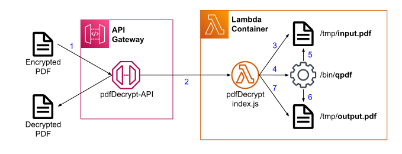

I have used [iLovePDF](https://www.ilovepdf.com) to decrypt password protected PDF files in GMail using [Google Apps Script](https://github.com/if-paul-then/mishmash/tree/main/ilovepdf-googleappsscript). Due to the typical sensitivity of these documents I have felt uncomfortable that another party has access to these documents.

This, and probably more because I like to tinker, I decided to create my own AWS Lambda function to decrypt PDF files using the QPDF Linux utility.  Alternative Linux utilities I considered were Ghostscript (probably a good alternative) and PDFTK (not well supported and unfriendly licensing).

The following picture show the design and call sequence:


## Create a node.js Lambda function and API
Based on https://docs.aws.amazon.com/lambda/latest/dg/services-apigateway-blueprint.html
1. Sign in to the AWS Management Console and open the AWS Lambda console.
2. Choose Create Lambda function.
3. Choose “Use a blueprint”.
4. Enter microservice in the search bar. Choose the microservice-http-endpoint blueprint and then choose Configure.
5. Configure the following settings.
    1. Function name – pdfDecrypt
    2. Role – Create a new role from AWS policy templates
    3. Role name – pdfDecryptRole
    4. Policy templates – Simple microservice permissions
    5. API – Create a new API
    6. API type – HTTP API
    7. Security – Open
    8. Choose Create function

## Create zip with QPDF executable and dependencies
In this section we’ll create a zip file containing QPDF and its dependencies which can be uploaded into the Lambda function.

The QPDF executable must have been compiled against the same CPU architecture and Linux flavour used by Lambda otherwise it cannot run.  The required CPU architecture is x86 and the Linux flavour is AWS Linux 2.

To ensure this we’ll install QPDF in an AWS EC2 instance that is x86 and AWS Linux 2 and zip it up in there.

1. Create a new AWS EC2 instance by following the tutorial at: https://docs.aws.amazon.com/AWSEC2/latest/UserGuide/EC2_GetStarted.html  
   Ensure that the machine image (AMI) is x86 and AWS Linux 2.
2. Connect to the EC2 instance.  For more info on connecting to EC2 instances, see https://docs.aws.amazon.com/AWSEC2/latest/UserGuide/AccessingInstances.html.
3. Install QPDF by running the command:
   ```
   sudo yum install qpdf
   ```
4. Create the following directory structure relative to the home directory:
   ```
   ~
     /pdfDecrypt
       /bin
       /sharedlib
   ```

   Using the following commands:
   ```
   mkdir ~/pdfDecrypt
   mkdir ~/pdfDecrypt/bin
   mkdir ~/pdfDecrypt/sharedlib
   ```
5. Copy QPDF into the bin directory:
   ```
   cp `which qpdf` ~/pdfDecrypt/bin/.
   ```
6. Next we need to copy the QPDF dependencies into the sharedlib directory.  To find the dependencies run:
   ```
   ldd `which qpdf`
   ```

   At the time of writing the only relevant dependency is: libqpdf.so.13
7. Copy the dependency:
   ```
   cp [dependency path from ldd command above] ~/pdfDecrypt/sharedlib/.
   ```
8. Create the zip file:
   ```
   cd ~/pdfDecrypt
   zip -r ../function.zip *
   cd ~
   ```
9. Download the zip file to your local machine.

   If you are using putty on Windows to connect to EC2 then you can use putty’s pscp command in the Windows command shell e.g.:
   ```
   pscp -i [key file] ec2-user@[EC2 instance’s DNS]:/home/ec2-user/function.zip .
   ```

   On Linux you can use the scp command to download the file by executing the following command in a terminal on the local machine:
   ```
   scp -i [key file] ec2-user@[EC2 instance’s DNS]:/home/ec2-user/function.zip .
   ```

## Upload zip into Lambda function
We’ll upload the zip file using Lambda’s “Code source” web user interface.
1. Open the Lambda function created initially in the AWS Lambda console.
2. Ensure the “Code” tab is open.
3. Click the “Upload from” dropdown on the right hand side and select “.zip file”.
4. Upload the zip file created above.
5. The file tree on the left hand side should now contain the directories and files from the zip file.

## Create the node.js file
In this section we will create a node.js program that will save the received pdf binary data in a temporary file location on Lambda, invoke QPDF and load the decrypted file again from the file system to send it back.
1. The Lambda function must still be open on the “Code” tab.
2. Right click on the pdfDecrypt root directory in the file tree, select “New File” and name it “index.js”.
3. Open the index.js file by double clicking it.
4. Paste the following code into the index.js file: [index.js](https://github.com/if-paul-then/if-paul-then.github.io/blob/master/_articles/pdf-decryption-using-qpdf-inside-aws-lambda/index.js)
5. Click “Deploy”

For more information on how binary data is handled, see this article: https://aws.amazon.com/blogs/compute/handling-binary-data-using-amazon-api-gateway-http-apis

## Test the API
In this section we’ll test the API using the “curl” command.  Any other tool could be used as well that can call REST APIs e.g. Postman.
1. Open the AWS API Gateway console and select the pdfDecrypt-API API.
2. In the “Stages” section, find the “default” stage and copy its “Invoke URL” to be used below.
3. Open a terminal in which the “curl” command can be executed.  If you don’t have one, then the EC2 instance created above could also be used.
4. Download a sample password encrypted PDF file to the terminal’s file system.
5. Call the pdfDecrypt API using the “curl” command and pass the sample PDF file:
   ```
   curl -X POST -H 'content-type: application/pdf' --data-binary @[path to sample pdf file from step 4] [Invoke URL from step 2]/pdfDecrypt > sample-decrypted.pdf
   ```
6. If all went well the decrypted pdf file is created as sample-decrypted.pdf.  Use a pdf viewer to check that it can be opened without a password.
